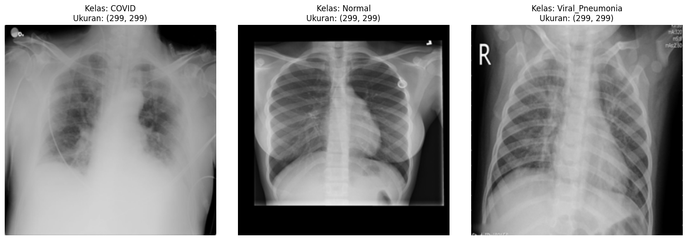
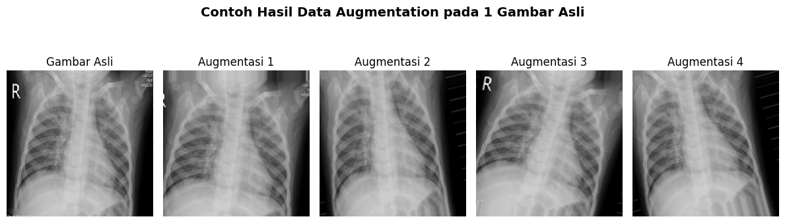
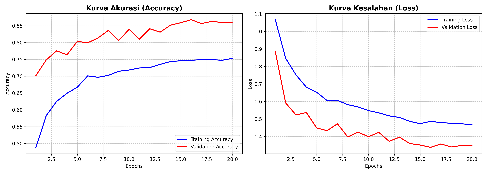
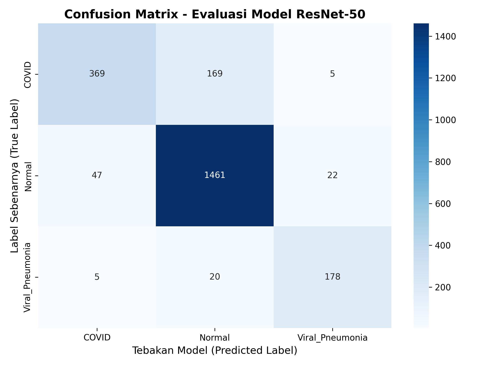
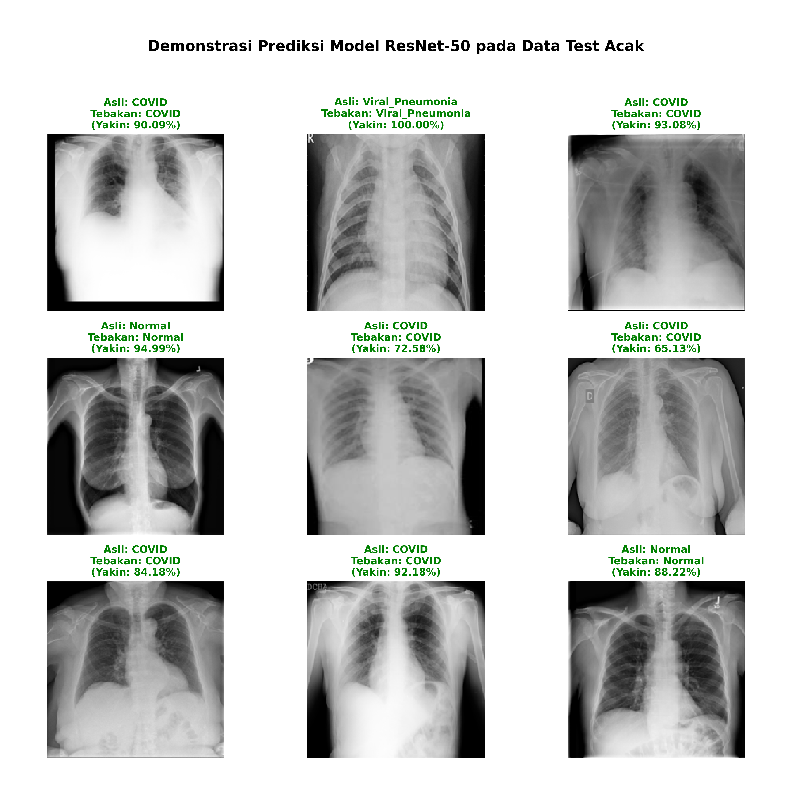

# 🫁 Implementasi Transfer Learning ResNet-50 untuk Klasifikasi Multikelas Penyakit Paru pada Citra X-Ray

Proyek ini merupakan implementasi **Deep Learning berbasis Computer Vision** untuk mengklasifikasikan penyakit paru dari citra **Chest X-Ray** menggunakan pendekatan **Transfer Learning dengan arsitektur ResNet-50**.

Model dirancang untuk mengklasifikasikan tiga kondisi paru:

* **Normal**
* **COVID-19**
* **Viral Pneumonia**

Pendekatan ini memanfaatkan kemampuan **Convolutional Neural Network (CNN)** untuk mengekstraksi fitur citra medis secara otomatis.

---

# 📌 Latar Belakang Masalah

Diagnosis penyakit paru melalui citra **Chest X-Ray** seringkali memiliki tantangan karena adanya **kemiripan pola visual** antara beberapa kondisi paru seperti:

* COVID-19
* Viral Pneumonia
* Paru-paru Normal

Kemiripan pola seperti **infiltrat atau bercak paru** dapat menyebabkan:

* kesalahan diagnosis
* proses analisis yang memakan waktu
* ketergantungan pada tenaga ahli radiologi

Untuk mengatasi masalah tersebut, penelitian ini mengembangkan model **Deep Learning berbasis ResNet-50** yang mampu melakukan klasifikasi citra secara otomatis.

---

# 📊 Dataset

Dataset yang digunakan berasal dari Kaggle:

**COVID-19 Radiography Database**

[https://www.kaggle.com/datasets/tawsifurrahman/covid19-radiography-database](https://www.kaggle.com/datasets/tawsifurrahman/covid19-radiography-database)

Dataset ini dikembangkan oleh **Tawsifur Rahman et al.**

Dataset asli memiliki **4 kelas**:

* COVID
* Normal
* Viral Pneumonia
* Lung Opacity

Namun pada penelitian ini hanya digunakan **3 kelas**.

### Alasan Menghapus Lung Opacity

Kelas **Lung Opacity** tidak merepresentasikan penyakit spesifik, melainkan hanya temuan radiologis umum yang dapat muncul pada COVID-19 maupun Pneumonia.

Penghapusan kelas tersebut bertujuan untuk:

* mengurangi ambiguitas fitur visual
* meningkatkan kemampuan model dalam membedakan penyakit secara klinis

---

# 🧠 Metodologi Penelitian

### 1️⃣ Image Preprocessing

Tahapan prapemrosesan citra meliputi:

**Image Resizing**

```
224 × 224
```

Ukuran ini menyesuaikan standar input **ResNet-50**.

**Normalisasi**

Nilai piksel dinormalisasi ke rentang:

```
0 – 1
```

**Data Augmentation**

Transformasi yang digunakan:

* Rotation
* Zoom
* Shift

Augmentasi membantu model belajar fitur yang lebih robust.

---

### 2️⃣ Dataset Splitting

Dataset dibagi menjadi:

* Training Set
* Validation Set (val)
* Testing Set

Validation digunakan untuk memantau performa model selama training.

---

### 3️⃣ Pembangunan Model

Model dibangun menggunakan **TensorFlow dan Keras** dengan pendekatan **Transfer Learning**.

Arsitektur yang digunakan:

**ResNet-50**

Keunggulan ResNet-50:

* menggunakan **skip connection**
* mengatasi **vanishing gradient**
* efektif untuk jaringan neural yang sangat dalam

Lapisan akhir dimodifikasi dengan **Fully Connected + Softmax** untuk klasifikasi multikelas.

---

# 📊 Contoh Dataset

<p align="center">

</p>

Gambar di atas menunjukkan contoh citra **Chest X-Ray** dari setiap kelas dataset.
Setiap kelas memiliki pola visual yang berbeda pada area paru-paru.

---

# 🔄 Data Augmentation

<p align="center">

</p>

Data augmentation dilakukan untuk meningkatkan variasi dataset dengan menerapkan beberapa transformasi citra seperti rotasi dan perubahan posisi gambar.

Teknik ini membantu model mengenali pola yang sama meskipun posisi citra berbeda.

---

# 📈 Kurva Training Model

<p align="center">

</p>

Grafik menunjukkan perubahan nilai **accuracy dan loss** selama proses training.

Hasil terbaik:

```
Validation Accuracy ≈ 90.18%
Validation Loss ≈ 0.286
```

Model menunjukkan performa yang stabil selama proses pelatihan.

---

# 🔎 Confusion Matrix

<p align="center">

</p>

Confusion matrix digunakan untuk mengevaluasi performa klasifikasi model.

Hasil menunjukkan bahwa model mampu mengklasifikasikan kelas **Normal** dengan sangat baik, sementara beberapa kesalahan klasifikasi masih terjadi antara kelas **COVID** dan **Normal**.

---

# 🖼 Contoh Prediksi Model

<p align="center">

</p>

Gambar di atas menunjukkan contoh prediksi model pada beberapa citra **test dataset** secara acak.

Setiap gambar menampilkan:

* label sebenarnya
* prediksi model
* tingkat kepercayaan prediksi

---

# 🧰 Tech Stack

<p align="center">


</p>

---

# 📁 Struktur Repository

```
LUNG-DISEASE-CLASSIFICATION-RESNET50
│
├── dataset
│   ├── raw
│   └── processed
│
├── models
│   ├── resnet50_best_model.h5
│   └── class_indices.json
│
├── notebooks
│   ├── 01_data_exploration.ipynb
│   ├── 02_preprocessing.ipynb
│   ├── 03_data_augmentation.ipynb
│   ├── 04_model_training_resnet.ipynb
│   ├── 05_model_evaluation.ipynb
│   ├── 06_visualization_results.ipynb
│   ├── 07_model_inference.ipynb
│   └── 08_prepare_deployment.ipynb
│
├── results
│   ├── confusion_matrix.png
│   ├── data_augmentation.png
│   ├── random_predictions_showcase.png
│   ├── sample_classes.png
│   └── training_accuracy_loss.png
│
├── utils
│
├── app.py
├── requirements.txt
└── README.md
```

---

# 🚀 Pengembangan Selanjutnya

Beberapa pengembangan yang direncanakan:

* Deployment aplikasi menggunakan **Streamlit**
* Visualisasi **Grad-CAM untuk Explainable AI**
* Peningkatan dataset
* Optimasi performa model

---

# 👨‍💻 Penulis

**Robi**
Mahasiswa Informatika

Proyek: **Deep Learning Lung Disease Classification**

